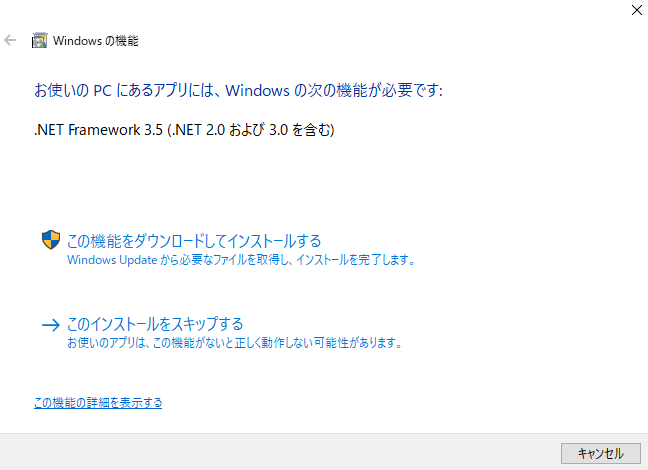
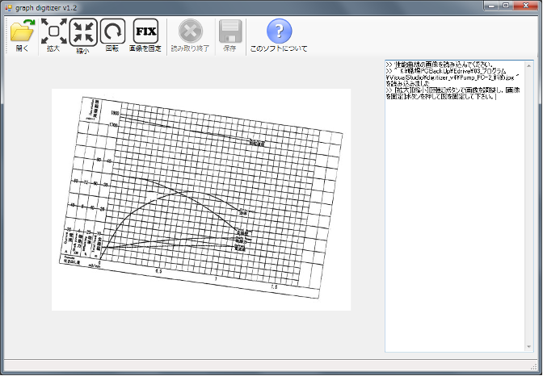
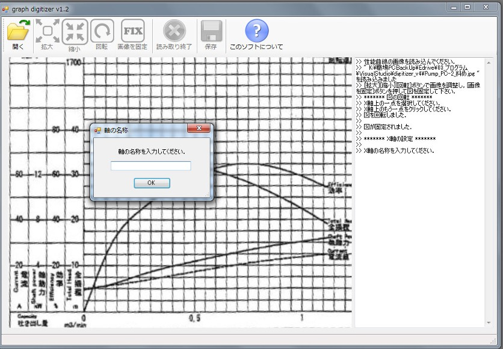
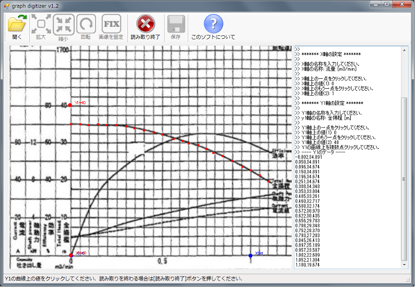
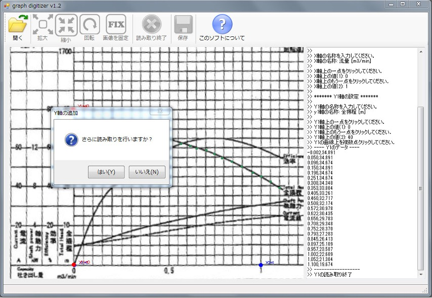
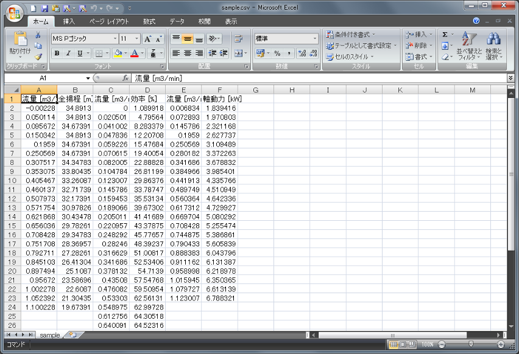

:lang: ja
:doctype: book
:toc: left
:toclevels: 2
:sectnums: 
:sectnumlevels: 4
:sectlinks: 
:linkattrs:
:icons: font
:source-highlighter: coderay
:example-caption: 例
:table-caption: 表
:figure-caption: 図
:docname: = graph_digitizer manual
:stem: latexmath
:xrefstyle: short
:stylesheet: clean.css

++++

++++

= 機器特性曲線デジタイザ マニュアル 

== はじめに

「機器特性曲線デジタイザ」は、機器メーカーより紙で提供される特性曲線をパソコン上で読み取ってデジタル化するためのツールです。

　建築物のエネルギーシミュレーションを実施する場合において、空調システムにおける熱源機器（チラーやボイラ）、ポンプ、ファンの特性曲線を読み取って各機器のモデルパラメータを同定する際に使用することを想定して開発されました。通常、機器の特性曲線はグラフで提供されるため、モデルパラメータを同定する際には手作業で曲線上の値を読み取るという煩雑な作業が発生します。本ツールを用いれば、パソコン上で特性曲線を効率よく読み取ることができます。ポンプの特性曲線のように、1つのx軸（流量）に対して、y軸に複数の項目（揚程、効率、軸動力）が設定されている場合において、効率良く特性曲線を読み取ることができるように工夫がなされています。

[#interface]
.インターフェイス
image::./figure1.jpg[figure1, 600, align="center"] 

=== ツールの機能

　本ツールは次の機能を有しています。

- デジタル化した特性曲線図（jpegファイル）を読み込んでモニタ上に表示する。
- 読み込んだ図面を調整（拡大・縮小、移動、回転）する。
- マウスを使って曲線上の値を読み取り、デジタル化する。
- 読み取った値をcsvファイルとして保存する。

=== 免責事項

本ツールの利用によってユーザーまたは第三者が損害をうけた場合にも、開発者は損害賠償責任を負いません。

<<<
=== 開発者

開発担当者：宮田 征門 + 
開発協力者：吉田 治典、王 福林、小野 永吉、張 兆明

=== ライセンス

This software is released under the MIT License. +
https://github.com/MasatoMiyata/graph_digitizer/blob/master/LICENSE

==  動作環境

　本ツールの利用には、.NET Framework 3.5 がインストールされた Windows 10 が必要です。.NET Framework 4系（4.7や4.8等）では動作しませんのでご注意下さい。

=== NET Framework 3.5 のインストール
　実行ファイル(graph_digitizer.exe)をダブルクリックした際、.NET Framework 3.5 がインストールされていない場合は、<<framework_install1>>のような画面が表示されます。

[[framework_install1]]
..NET Framework 3.5のインストールを促す画面
 

　<<framework_install1>>における「この機能をダウンロードしてインストールする」をクリックすると、自動的にインストールが始まります。
インストールが完了すると、<<framework_install2>> に示す画面が表示されます。

[[framework_install2]]
..NET Framework 3.5のインストール完了
image::framework_install2.png[framework_install2, 400, align="center"] 

<<<
=== 警告が表示される場合

　実行ファイル(graph_digitizer.exe)をダブルクリックした際に、<<warning>> のような警告が表示される場合があります。
<<warning>> の画面に表示される「アプリ」の名称が「graph_digitizer.exe」であることを確認のうえ「実行」をクリックしてください。

[[warning]]
.警告の表示
image::warning.png[framework_install2, 400, align="center"] 

<<<
== ツールの使い方

=== ツールの起動と特性曲線図の読み込み

　実行ファイル(graph_digitizer.exe)をダブルクリックすると <<Figure02>> に示す画面が表示されます。これが本ツールのインターフェイスです。

[[Figure02]]
.機器特性曲線デジタル化ツールのインターフェイス
 

　インターフェイスの上部にツールバーがあり、このツールバー上に操作に必要なボタンが並んでいます。
まずはツールバー上の「開く」ボタンを押し、特性曲線の画像ファイル（jpegファイル）を読み込んでください。
 <<Figure02>> は画像ファイルを読み込んだ後の画面です。

=== 図の調整（拡大・縮小、移動、回転）

　ツールバーの「拡大」ボタン、「縮小」ボタン、「回転」ボタンを押すことで、図の調整ができます。
また、図をドラッグすることで表示範囲の変更が可能です。
曲線を読み取りやすいように、適宜図の大きさ・位置を調整してください。
図の調整が終わったら「画像を固定」ボタンを押して下さい。

<<<
=== 軸の設定
　「画像を固定」ボタンを押すと、自動的に軸の設定に移ります。
表示される指示に従い、X軸（横軸）、Y軸（縦軸）の設定を行ってください。
各軸の名称、軸上の2点の位置（マウスでクリックして指定します）とその点の値を入力します（ <<Figure03>> 、 <<Figure04>> ）。

[[Figure03]]
.軸の名称を入力する画面
 

[[Figure04]]
.軸上の一点をクリックし、その値を入力
image::figure4.jpg[figure4, 600, align="center"] 

<<<
=== 曲線の読み取り
　軸の設定が終わると「曲線上の値をクリックしてください」と表示されますので、
設定した軸に対応する曲線上を複数点クリックしてください（ <<Figure05>> ）。
クリックした点の値が右側のメッセージボックスに表示されます。 +
　読み取りが終われば、「読み取り終了」ボタンを押してください。

[[Figure05]]
.曲線の読み取り
 

<<<
=== 他の曲線の読み取り
　例えば、ポンプの特性曲線のY軸は「全揚程」「効率」「軸動力」「電流」と4種類の情報を表しています（ <<Figure06>> を参照）。
このような複数のY軸（縦軸）を持つ特性曲線についても効率よくデジタル化できるように、X軸の設定は引き継ぎ、
Y軸のみを新たに設定して、異なるY軸の曲線を継続して読み取る機能を本ツールは持っています。

　「読み取り終了」ボタンを押した後、「さらに読み取りを行いますか」と表示されますので（ <<Figure06>> ）、
異なる縦軸の値を継続して読み取りたい場合は、「はい」を選択してください。この場合は、3.3、3.4の作業を繰り返すことになります。

　また、例えば冷凍機の特性曲線において、運転効率の曲線が冷却水温度ごとに複数本描かれている場合がありますが、
これらの曲線を連続して読み取る場合はY軸を再設定する必要はありません（全ての曲線でY軸は共通であるため）。
このような曲線を読み取る場合を想定して、X軸、Y軸ともに設定を引き継ぎ、連続して複数の曲線を読み取る機能も本ツールは持っています。
本ツールでは、何本の曲線でも連続して読み取ることが可能です。

[[Figure06]]
.他の曲線も連続して読み取りを行うかを入力
 

<<<
=== 読み取った値の保存
　「保存」ボタンを押すと、読み取った値がcsvファイルに保存されます（ <<Figure07>> ）。

[[Figure07]]
.読み取った値を保存したcsvファイル
 
